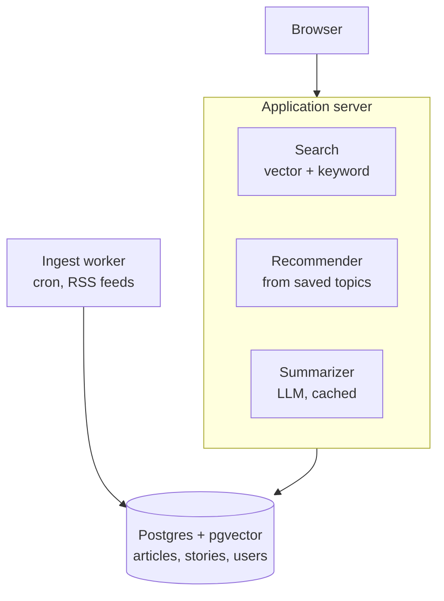
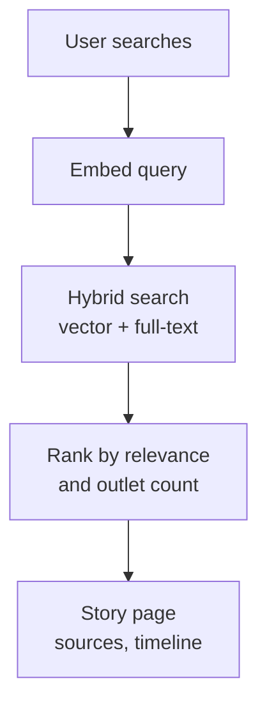
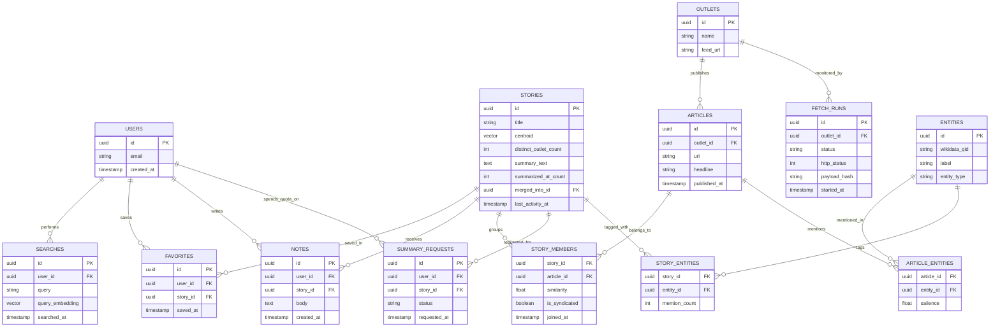

# Design doc: Presswake

**Status:** Draft
**Author:** *(you)*
**Last updated:** *(date)*

*Presswake: the trail a story leaves as outlets pick it up. Pitch: "See how every outlet covered the same story."*

---

## Context

Reading about a developing news event means opening five tabs, noticing that three of them say slightly different things, and having no way to tell who reported what first or which outlets skipped it entirely. Aggregators like Google News group headlines but optimize for freshness, not for comparison — you get a list, not a picture of the coverage.

The information needed to build that picture is public and free: most outlets publish RSS feeds with headlines, ledes, timestamps, and links. Nobody archives it in a way that makes cross-outlet comparison queryable. That archive is the product, and it compounds — a month of continuous ingestion produces a dataset that can't be reproduced in a weekend.

This document describes a system that continuously ingests news from many outlets, clusters articles into *stories*, and presents each story as a single page showing every outlet's coverage, when each published, and an AI-generated synthesis.

## Goals

1. **Cluster correctly.** Articles about the same event group into one story. Target: ≥0.85 precision and ≥0.75 recall against a hand-labeled evaluation set of 200 article pairs.
2. **Answer search from the local corpus.** A topic search returns relevant stories in under 500ms p95, without a live network fetch on the common path.
3. **Show coverage, not opinion.** Every story page displays which outlets covered it, when, and with what headline — observable facts, no editorial scoring.
4. **Summarize cheaply.** AI summaries are cached and regenerated only when a cluster grows meaningfully. Target: fewer than one LLM call per story per day on average.
5. **Run within free hosting tiers** at portfolio-scale traffic. Target hosting cost: $0–5/month.
6. **Stay observable.** A public status page shows ingestion health, last successful run per outlet, and detected gaps.

## Non-goals

Explicitly out of scope for v1. Each of these is a real feature; none is required to demonstrate the idea works.

- **Bias or political-lean scoring.** Published bias ratings are contested and methodologically disputed. Presenting one as fact means defending someone else's methodology. Divergence is shown instead, and the reader draws conclusions.
- **Full article text display.** Headlines, timestamps, links, and original summaries only.
- **Public comment threads.** See "Alternatives considered."
- **Real-time updates.** No websockets, no live-updating feeds. Polling and page refresh are sufficient.
- **Mobile app, public API, notifications, social features.** Not in v1.
- **Non-English sources.** Clustering quality across languages is a separate problem.
- **Paywalled content.** RSS metadata only; no bypassing access controls.

## Proposed design

### System shape



The ingest worker runs **outside** the application server, on a separate schedule, touching only the database. The web app can redeploy or fail without dropping a fetch cycle, and the worker can run on a free cron service independent of where the app is hosted.

### Ingestion

A cron trigger fires the worker on a fixed cadence. For each configured outlet:

1. Fetch the RSS or Atom feed with a descriptive `User-Agent` including contact info. Send `If-Modified-Since` / `ETag` so unchanged feeds return a cheap 304. Honor `robots.txt`, declared `<ttl>`, and per-domain rate limits.
2. Record a row in `fetch_runs` with status, HTTP code, byte count, and payload hash — successful or not.
3. Store the raw feed body immutably (object storage, with only the hash in Postgres).
4. Parse into `articles`, deduplicating on the item `<guid>` where present, falling back to canonical URL. URLs acquire tracking parameters and occasionally change; the outlet's own guid is the more stable key.

Feeds typically expose only the most recent 20–50 items, so polling cadence must stay ahead of a busy outlet's publish rate or articles silently scroll off before they are seen. Use a library that normalizes RSS and Atom rather than hand-rolling parsers for both.

**Raw payloads are never overwritten.** Parsers have bugs and upstream feeds change shape without warning; every derived table must be rebuildable from raw via a `reprocess` command. Reruns are safe because inserts use `ON CONFLICT DO NOTHING` against natural-key unique indexes.

### Clustering

The core problem: decide that eleven articles from nine outlets describe the same event. Clustering is **incremental**, not batch — each new article is assigned on arrival.

**Clustering is unconditional.** Every ingested article is clustered, with no prior knowledge of what is popular or newsworthy. There is no topic-selection step, because topic popularity is measured *from* the corpus and therefore cannot also gate entry to it. What is selected is the *outlet set*, not the subject matter. Popularity is read off the results afterward.

For each new article:

1. Embed `headline + lede` using a 384-dimension sentence embedding model.
2. Retrieve candidate story centroids **within a ±48 hour window**. Time-boxing is what makes this tractable and correct — "Fed raises rates" in March is not the same story as in July.
3. Compute cosine similarity against each candidate centroid.
4. Require **at least one shared named entity** (person, organization, location) with the candidate story. Cosine similarity alone happily merges unrelated stories that share political vocabulary; the entity gate removes most false merges.
5. If the best candidate clears the similarity threshold, join it and update the centroid. Otherwise create a new story.

Every membership decision writes `story_members` with the similarity score and timestamp, so clustering can be replayed at a different threshold and diffed against the current state.

**Merges.** As coverage accumulates, two stories may turn out to be one. Merges are soft: the absorbed story gets a `merged_into_id` pointer and its URL redirects. Deleting would orphan user favorites and break links.

**Syndication.** Wire copy from AP or Reuters is republished near-verbatim across many outlets. A nine-member cluster may be nine independent newsrooms or one wire report run eight times — completely different things for a product about comparing coverage, and the second case renders nine identical headlines in the comparison view. Articles within a cluster exceeding ~0.97 cosine similarity (or with matching normalized headlines) are flagged `is_syndicated`. Two counts are tracked: total members, and `distinct_outlet_count` over non-syndicated members. **Ranking uses the latter.**

**Expected distribution.** Cluster sizes are roughly power-law: most stories remain clusters of one permanently, a smaller set reach two or three, and a thin daily handful exceed ten. Singletons are correct output, not clustering failure — they are what supports the claim that only one outlet covered something. Display surfaces filter on outlet count; the singleton tail is retained but rarely rendered.

### Search

A user query is embedded and run as a hybrid search — vector similarity against story centroids, combined with Postgres full-text search over headlines — against the **existing corpus**. No live fetch on the common path.



Everything expensive already happened during background ingestion. Search touches no external service and makes no LLM call on the common path.

**Live fetch on thin coverage is cut from v1.** An earlier draft branched to an on-demand fetch job when the corpus had no coverage of a query. This only helps for topics outside the subscribed outlet set entirely, and it costs a background job queue, a polling endpoint, and client-side progressive loading. Returning "no coverage yet" is an acceptable answer and deletes the subsystem.

### Summaries

Summarization is the **only metered operation in the system.** RSS fetching is free, and embeddings run locally in the worker at no per-call cost. The entire cost budget therefore lives here, and nowhere else.

Summaries are generated from the headlines and ledes of a story's members and cached on the story row. Prompts instruct the model to note where accounts differ rather than smoothing over disagreement, are constrained to the supplied text, and every rendered summary is labeled machine-generated with its source list directly beneath it.

**Daily budget.** A scheduled job summarizes the top N stories per day, where N is a config value rather than a literal:

```sql
select id, title, distinct_outlet_count
from stories
where merged_into_id is null
  and last_activity_at > now() - interval '48 hours'
  and (summary_text is null
       or distinct_outlet_count >= summarized_at_count * 1.5)
order by distinct_outlet_count desc, last_activity_at desc
limit :daily_summary_budget;
```

One query covers both never-summarized stories and stories whose summary went stale because the cluster grew 50% since it was written.

**Lazy fallback.** Any story opened without a cached summary is summarized on first view and cached permanently. The daily budget is therefore a prefetch heuristic for likely-viewed stories, not a correctness boundary — no story is ever unsummarizable.

**User-requested summaries.** Users may spend a daily quota to summarize a specific story ahead of the budget. Because the story is already clustered, the request is exactly one LLM call. Concurrent requests for the same story attach to the in-flight generation rather than duplicating it. Quota is enforced by counting rows in `summary_requests` over a trailing 24 hours, not by decrementing a stored counter — counters drift and cannot be audited after a bug.

Note the economics: a generated summary is cached and then visible to everyone, so quota spend improves the shared corpus rather than consuming a private resource. Quota is built as a rate-limiting mechanism in v1; **live payments are a non-goal** (Stripe test mode only, if checkout is wanted at all).

### Recommendations

Deliberately not a machine learning system. The user's `searches.query_embedding` values and the centroids of their favorited stories are averaged into a single preference vector; the home feed is a nearest-neighbor query against story centroids, filtered to recent stories and excluding already-seen ones.

**Cold start:** new and logged-out users see *trending*. This requires zero user data and remains the logged-out landing page permanently.

**Trending ranks on velocity, not lifetime total.** A cluster's size grows over hours as coverage accumulates, so a story that reached six outlets in ninety minutes is more newsworthy right now than one that reached twelve over three days. Trending counts *distinct outlets added within the last N hours*, computed from `story_members.joined_at`.

`distinct_outlet_count` is denormalized onto `stories` and updated on each membership insert. It is the single column driving trending, the summarization budget, and recommendation filtering; computing it per request would mean a join and aggregate on every home page load. Index on `(distinct_outlet_count desc, last_activity_at desc)`.

**Known bias:** outlets publishing at high volume appear in more clusters purely by volume, which can make trending repetitive. Not addressed in v1, but the cause is documented so it isn't mistaken for a clustering defect.

### Data model



`observations`-style append-only discipline applies to `story_members`: rows are added, never mutated, so clustering history is auditable.

### The story page

The differentiating surface. Structure, in order:

1. **Header:** distinct outlet count and relative time. The count is the primary credibility signal.
2. **Generated headline** plus a one-line **significance subhead**. The subhead states why the story matters or what happens next — it does not restate the headline. This distinction is most of what makes the cards readable.
3. **Overview:** four to five bullets, not prose. Each bullet has a fixed job and the sequence is consistent: what was confirmed → hard numbers → a specific attributable detail → the mechanism → what remains unresolved. Labeled as machine-generated. Named entities within bullets link to entity pages.
4. **Coverage timeline** — each outlet plotted at its publish time, making lead time and gaps visible at a glance. *Not offered by any current competitor.*
5. **Headline comparison** — the full list side by side, so framing differences are visible without being editorialized. Syndicated members are grouped and collapsed so wire copy does not masquerade as independent coverage. *Also not offered by any current competitor.*
6. **Sources** — links out to originals.

Open Graph tags are set per story from the lead article's image and the significance subhead, so shared links render as cards.

Deferred: quote extraction (requires full article text, which RSS does not supply and which would need publisher relationships to use legitimately).

### Entity extraction and linking

Entities serve four purposes, in order of when they land:

1. **The clustering gate** (milestone 3). Comparing raw NER strings fails on surface-form variation — "U.S." and "United States" do not match, which forces fuzzy string heuristics. Canonical IDs make the gate an integer set intersection.
2. **Entity pages.** `/entity/Q30` is every story mentioning that entity, newest first. One query.
3. **Topic taxonomy without maintaining one.** Wikidata's `P31` / `P279` properties roll entities up into categories, replacing a hand-built taxonomy that would otherwise need continuous curation.
4. **Explainable recommendations.** Averaged embeddings work but can never say *why* something was recommended. Entity follows can: "in your feed because you follow Japan."

**Staged rollout.** Milestone 3 ships NER only — spaCy, with normalized surface strings (lowercased, honorifics and leading articles stripped). This is enough for the gate. Linking to Wikidata QIDs comes after clustering is tuned, so clustering is never blocked on it.

**Wikidata over Google Knowledge Graph MIDs.** Google's Cloud Natural Language API returns Freebase-style `/m/` identifiers and does the linking for you, which is lower effort and higher accuracy. Rejected on three grounds: per-call cost, an opaque ontology that cannot be inspected or extended, and vendor lock-in on a core data structure. Wikidata is CC0, downloadable in full, and its properties supply the category hierarchy described above.

**Validate every QID before storing it.** If linking is done by LLM rather than a purpose-built linker, models return plausible identifiers that resolve to the wrong item or to nothing. One lookup per new entity, cached permanently. An unvalidated QID is worse than no QID, because it silently corrupts the clustering gate and recommendations simultaneously.

`entities` rows exist independently of `wikidata_qid`, which is nullable — local figures and small organizations often are not in Wikidata and must still work in the clustering gate.

## Competitive landscape

| Product | Approach | What it does not do |
|---|---|---|
| Ground News | Left/center/right ratings across 50k+ sources; blindspot feed | No publication timing, no coverage velocity |
| AllSides | Curated side-by-side headlines, ~1,400 outlets, manual rating | Limited depth; manual process |
| Particle | AI-generated headline, significance subhead, bulleted overview, entity links, tabbed detail | Shows article count and one relative timestamp; no timeline, no wire/independent distinction |
| memeorandum | Fully automated clustering, no editorial layer | No summaries, no comparison surface |
| Google News Full Coverage | Multi-source story grouping at enormous scale | Optimized for reading, not comparison |

Every competitor treats bias as the axis of comparison. **Time and syndication are unoccupied.** Both are computable from data these products already hold, which is evidence they are unclaimed by choice rather than difficulty — the bet is that they are more useful than a lean score, not that they are harder to build.

## Alternatives considered

**On-demand fetching at query time.** The obvious reading of "search a topic and it finds articles." Rejected: multi-second response times, per-request API cost, rate limits that break under any traffic, and — critically — no accumulated archive, which is the only durable advantage this project has. Background ingestion inverts this: the corpus grows continuously and search is a local query. On-demand survives as a fallback for thin coverage.

**1536-dimension embeddings.** Higher-quality general-purpose embeddings, but each vector is roughly 6 KB. At 100k articles that is ~600 MB of vectors alone, exceeding the free-tier database entirely, and the ANN index grows proportionally. 384 dimensions costs ~1.5 KB per article and keeps the index fast on shared compute. Revisit only if the evaluation set shows dimension is the accuracy bottleneck — not on intuition.

**Batch re-clustering on a schedule.** Simpler to reason about and produces globally better clusters. Rejected for v1: new articles wouldn't appear until the next batch, and re-embedding the full corpus repeatedly is the single most expensive thing the system could do. Incremental assignment with periodic merge passes gets most of the quality at a fraction of the cost.

**Bias/lean scoring per outlet.** The most requested feature in this category and the most dangerous. Any score imports a contested methodology and makes the site an argument rather than a tool. Coverage timelines and headline comparison are observable, defensible, and more technically interesting to build.

**Rate-limiting clustering to N topics per day.** Proposed as a cost control. Rejected on correctness grounds, not cost: partial clustering makes "no outlet covered this" indistinguishable from "this was not clustered yet," which silently invalidates every coverage-gap claim the product makes. Clustering must be exhaustive over what is ingested. The cost concern was misplaced anyway — clustering is not the metered operation, summarization is, and the budget belongs there.

**Selecting daily topics to cluster.** Circular: topic popularity is derived from the corpus, so it cannot gate entry to the corpus. The selectable input is the outlet list.

**Public comment threads.** Cut in favor of **private notes** — same schema, same UI surface, visible only to their author. Public comments on news stories generate a moderation obligation that is a full project in itself, and the engineering skill demonstrated is negligible. Revisit only with a moderation plan.

**Running the ingest worker inside the web app.** Fewer moving parts, but ties fetch reliability to web deploys and, on serverless hosts, to execution timeouts that long-running fetch cycles exceed. A separate scheduled worker sidesteps both.

## Risks and open questions

| Risk | Mitigation |
|---|---|
| Clustering quality is unacceptable and threshold tuning doesn't fix it | Build clustering at milestone 3, before auth or personalization. Discover this in week two, not week six. |
| Feed formats vary more than expected; parsers break | Raw payloads retained; `reprocess` rebuilds derived tables. Schema-drift assertions fail loudly. |
| Database free tier exhausted by compute wake-ups | Poll at the slowest justifiable cadence; batch all writes into one connection per run. |
| Embedding costs scale with volume | 384-dim model; embed once at ingest, never at query time for articles. |
| Outlet blocks the crawler | Descriptive User-Agent with contact, conservative rate limits, honor `robots.txt`. Feeds are opt-in publishing, so this should be rare. |
| LLM summary states something the sources don't support | Summaries labeled as generated, sources listed directly beneath, prompt constrained to supplied text only. |

**Open:** How many outlets before clustering quality degrades? What's the right similarity threshold — set empirically at milestone 3. Should stories expire from the home feed on age or activity?

## Deployment

Three independently deployable pieces, chosen so each sits on a free tier that fits its workload:

| Piece | Target | Why |
|---|---|---|
| Web app | Vercel or Cloudflare Pages | Git-push deploys, preview URLs, no server to manage |
| Ingest worker | GitHub Actions scheduled workflow | Full runtime, arbitrary dependencies, no cold-start penalty, no spin-down |
| Database | Neon Postgres + pgvector | Managed Postgres with branching; pgvector without self-hosting |
| Raw payloads | Cloudflare R2 | Keeps feed bodies out of the 0.5 GB database tier |

The worker deliberately does **not** run on the web host. Serverless function timeouts are incompatible with a fetch cycle across 30 feeds, and free container tiers spin down when idle. A scheduled CI job has neither constraint and can `pip install` an embedding model.

**Connection pooling.** Serverless app instances open connections per invocation and will exhaust Postgres under trivial load. The app uses Neon's *pooled* connection string; the worker and migrations use the *direct* string. Two different URLs, both in secrets, easy to get wrong once and never again.

**Compute budget.** Neon's free tier meters compute in CU-hours with scale-to-zero, and each worker run wakes the database for a minimum window. Polling every few minutes can consume the monthly allowance on wake-ups alone. Cadence is hourly, and each run opens one connection and batches all writes.

**Scheduled-workflow caveats.** GitHub Actions cron is best-effort and can fire late under load, and scheduled workflows are disabled after a period of repository inactivity. Neither matters for hourly news ingestion, but both must be understood before treating the schedule as a guarantee. The `/status` page exists partly to make a silently stopped schedule visible.

**Language split.** The worker is Python (mature embedding and NER ecosystem); the app is TypeScript. The database schema is the contract between them, with migrations owned by one side only. The alternative — a single TypeScript codebase using a JS embedding runtime — trades ML ergonomics for operational simplicity and is a reasonable choice for a solo developer who prefers not to context-switch.

## Milestones

Ordered to front-load risk. Auth is a solved problem and teaches nothing about viability; clustering is where the project could fail.

1. **Walking skeleton.** One feed, one table, one list page, deployed to production. No clustering. Purpose: absorb all deploy, connection-string, and environment friction while the codebase is trivially debuggable.
2. **Real ingestion.** Ten outlets, dedup, `fetch_runs` logging, public `/status` page.
3. **Clustering + evaluation.** Embeddings, incremental assignment, entity gate. 200 hand-labeled pairs checked into the repo with a script reporting precision and recall. *This milestone is the project's technical core.*
4. **Story pages.** Coverage timeline, headline comparison, outlet list. **First genuinely demoable state.**
5. **Cached summaries.** LLM synthesis with regeneration policy.
6. **Accounts.** Auth, favorites, search history, private notes.
7. **Recommendations.** Preference vector, personalized home feed, trending fallback.

Milestones 5–7 are additive. Stopping after 4 still yields a complete, defensible project.

## Appendix: evaluation methodology

Sample 200 article pairs from the corpus, stratified so roughly half are plausible near-matches rather than random pairs (random pairs are trivially negative and inflate the score). Label each same-story or not by hand. Store as `eval/pairs.csv` in the repo. `scripts/eval_clustering.py` reports precision, recall, and F1 at the configured threshold, plus a sweep across thresholds.

Rerun on every change to embedding model, threshold, or entity-gating logic. Record results in the README — publishing the number, including when it's mediocre, is the point.